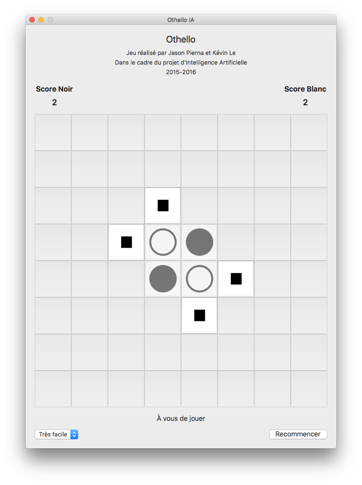

# OthelloGame

*OthelloGame* is a school project realized by Jason PIERNA & Kévin LE for our AI course at *Université Paris Descartes*.

The entire project was originally made with Swift 2.2, but later updated to Swift 3.1.

Othello is a zero-sum game, so we implemented the following algorithms :
* Minmax (depth 2)
* AlphaBeta (depth 3)
* NegaScout (depth 4, *beta*)

